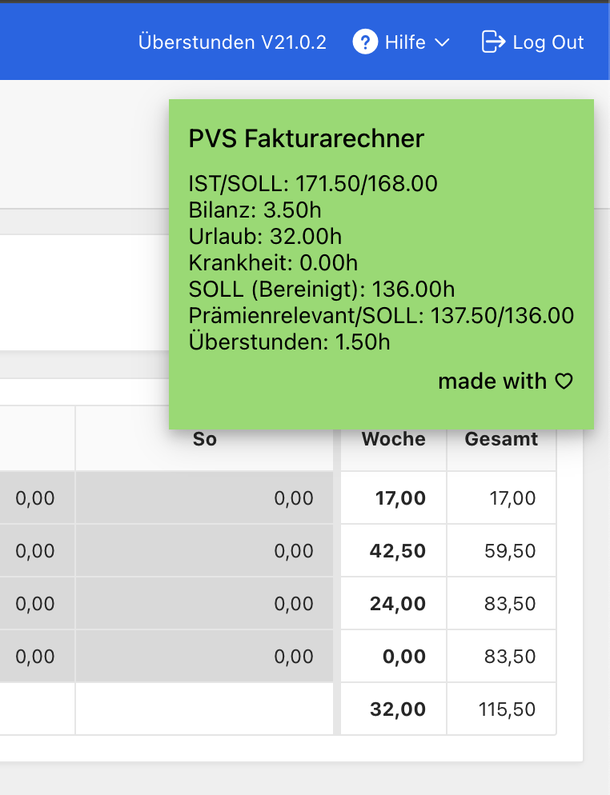
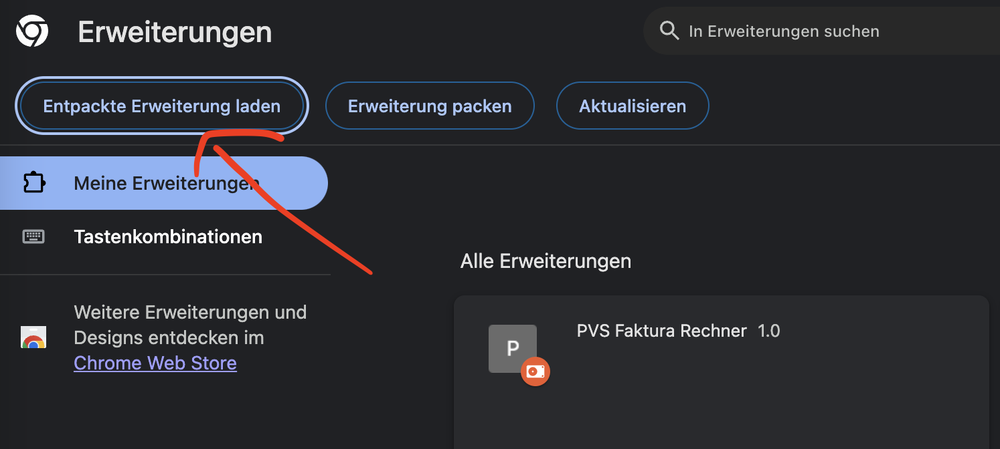

# PVS Faktura Rechner

## Beschreibung
Ein kleines Chrome-Plugin, welches als Erweiterung eingebunden werden kann, um in der Monatübersicht des PVS-DC
weitere Informationen z.B. über den aktuellen Stand der Stunden, Überstunden und fakturierten Arbeitszeiten zu
erhalten.

Das Plugin arbeitet komplett lokal und nutzt für die Auswertung Informationen, die auf der PVS-DC-Seite zu sehen sind.
Es werden keine keine Daten an irgendwelche Services rausgesendet.

**DISCLAIMER** 
> :warning: Das Tool wurde in der Freizeit entwickelt und weiterentwickelt. Alle ausgegeben Angaben
sind nach bestem Gewissen ermittelt aber ohne jegliche rechtliche gewähr. Bitte prüft eure Stunden
selbstständig nach und nutzt das Tool ggfs. als Unterstützung.

## Installation
1. Klone / kopiere dir dieses Repository lokal in einen Ordner z.B. /pvsfakturacalculator
2. Lade die Erweiterung im Chrome 
   1. Im Chrome --> Erweitertes Menü (...) --> Erweiterungen --> Erweiterungen verwalten
      
   2. Oben rechts auf den Button "Entpackte Erweiterung laden" klicken und das im Schritt 1 ausgewählte Verzeichnis auswählen und bestätigen

Fertig. Jetzt solltet ihr in den Erweiterungen ein neues Element mit dem Namen "PVS Faktura Rechner" sehen.

## Nutzung
Die Chrome-Erweiterung ist nur auf der Überstundenseite aktiv. Öffnet in PVS-DC die Seite "Überstunden" (Aufwände -> Überstunden)
und ihr solltet das Overlay mit allen Informationen sehen.

## Troubleshooting
Beim Monatswechsel und der Aktualisierung der Seite wird das Plugin manchmal nicht angezeigt. Oft hilft dann ein 
einfacher Refresh der Seite (F5).
